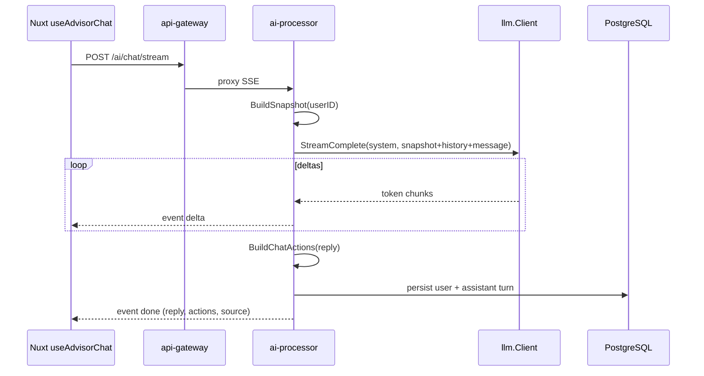

# Архитектура финансового советника

> Продукт: [advisor.md](../product/advisor.md). API: [API_Contract.md](../api/API_Contract.md) § Advisor.

## Обзор

Советник — серверная подсистема в **ai-processor** (порт 8100). Клиент не собирает финансовый контекст: только `message`, `history` и JWT.

```
[Nuxt /advisor, /dashboard]
        │  JWT
        ▼
[api-gateway :8000]  /api/v1/ai/*
        │
        ▼
[ai-processor :8100]
   ├─ advisor/handler.go     HTTP
   ├─ internal/advisor/*     доменная логика
   ├─ internal/llm/*         LLM client
   ├─ postgres               profile, manual_expenses, chat history
   └─ file volumes           profile/credits mirror (demo)
```

## Snapshot (`UserFinanceSnapshot`)

Файл: `backend/internal/advisor/snapshot.go`

| Поле | Источник |
|------|----------|
| Доход, подушка, цель, skip-флаги | PostgreSQL `user_financial_profiles` |
| Кредиты, DTI | `user_credits` (PDF scan) + file mirror |
| Траты по категориям | `manual_expenses` + ClickHouse aggregates |
| Ставки vs рынок | rates-aggregator (credit-service) |
| `data_completeness` | эвристика по заполненности |

**Skip-aware:** `skipped_income: true` не означает «доход = 0» — промпты и heuristic не строят runway на пустых данных.

## Эндпоинты

| Метод | Путь | Назначение |
|-------|------|------------|
| GET | `/api/v1/ai/plan` | План (3 шага) + вложенный diagnosis |
| GET | `/api/v1/ai/diagnosis` | Score, indicators, main_action |
| POST | `/api/v1/ai/chat` | Синхронный ответ + actions |
| POST | `/api/v1/ai/chat/stream` | SSE: `ready` → `delta` → `done` |
| GET | `/api/v1/ai/chat/history` | История из PG |
| DELETE | `/api/v1/ai/chat/history` | Сброс истории |

Gateway проксирует `/ai/*` на ai-processor с flush для `text/event-stream`.

## Chat pipeline



### Ответ

```json
{
  "reply": "…",
  "actions": [
    { "type": "navigate", "label": "Профиль", "payload": { "path": "/profile" } }
  ],
  "source": "gemini",
  "id": "uuid"
}
```

`source`: `gemini` — LLM успешен; `heuristic` — шаблонный fallback.

### Actions

Файл: `backend/internal/advisor/actions.go`

| type | Пример |
|------|--------|
| `navigate` | `/profile`, `/credits`, `/analytics` |
| `add_expense` | открыть sheet добавления траты |
| `followup` | быстрый follow-up prompt в чат |

Фронт: `AdvisorChatActions.vue`, dispatcher в `useAdvisorChat`.

## Персистентность чата

Таблица: `advisor_chat_messages` (миграция PG).

- POST chat/stream сохраняет пару user/assistant;
- GET history — последние N сообщений;
- DELETE — очистка для «Новый диалог».

## Frontend (ветка `front`)

| Компонент / composable | Роль |
|------------------------|------|
| `/advisor` | Полноэкранный чат (вкладка + mobile tab bar) |
| `useAdvisorChat` | history API, SSE stream, quick prompts, reset |
| `useOpenAdvisorChat` | deep link `/advisor?ask=` |
| `FinancialPlanCard` | план с `/ai/plan` |
| `PageNarrative` | narrative + mindfulness score из diagnosis |
| `DashboardMindfulnessScore` | score/100 из AI diagnosis |
| `ScenarioSimulator` | «Что если» на dashboard |

**Убрано (2026-05-31):**

- встроенный советник в sidebar (`AppSidebarAdvisor`);
- страница `/digest` — «Траты под контролем» перенесены на dashboard (`PageNarrative`).

## Smoke / тесты

```bash
cd backend
./scripts/smoke_auth_chat.sh
go test ./internal/llm/...
go test ./internal/advisor/...
```

## Связи

- [llm-integration.md](./llm-integration.md)
- [overview.md](./overview.md)
- [../phases/phases.md](../phases/phases.md) — фазы 6–9
