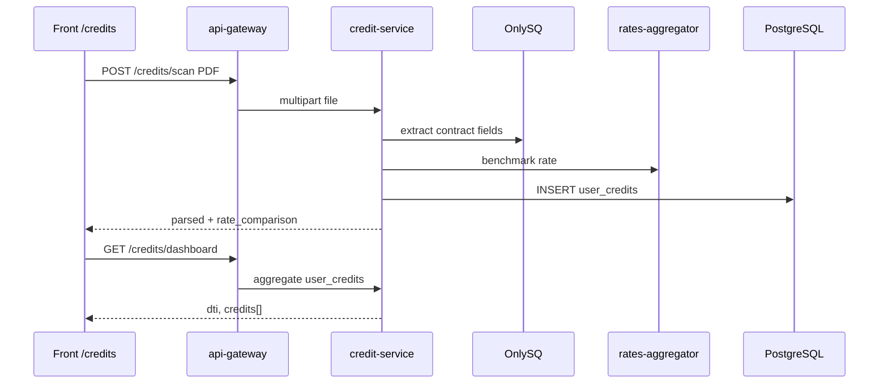

# Кредиты: PDF-скан и rates-aggregator

> Единственный источник кредитных данных в MVP.

## Поток

## POST /credits/scan

- `multipart/form-data`, поле `file` (PDF)
- Text extraction поддерживает **кириллические** договоры (pdf parser + OnlySQ)
- OnlySQ извлекает: bank, amount, rate, term_months, monthly_payment
- rates-aggregator возвращает `benchmark_rate` для сравнения
- Запись в `user_credits`

## GET /credits/dashboard

- Агрегат по `user_credits` пользователя
- Пустой ответ (dti=0, credits=[]) до первого скана
- `dti` в **процентах** 0–100 (как на front)

## rates-aggregator

Env: `RATES_AGGREGATOR_URL`, `RATES_AGGREGATOR_API_KEY`.

MVP: mock + ключевая ставка ЦБ (fallback). Провайдер (Banki.ru и т.д.) — позже.

Internal: `GET /internal/rates?product=consumer&amount=&term=`

## Не используется

- bank-service для кредитов
- demo hardcode в handler
- ручной ввод кредита без PDF
