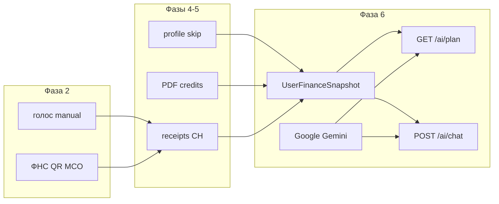

# Фазы разработки (MVP «Поток»)

> Продуктовый roadmap. Статус сверен с ветками **`back`** и **`front`** (2026-05-30).  
> Scope: [scope.md](../product/scope.md). Старые hackathon-фазы 2–3 (X5/Magnit) **не входят** в MVP.

| # | Фаза | Критичность | Статус |
|---|------|-------------|--------|
| **0** | Docs, CI, scope trim | Блокер | ✅ |
| **1** | Infra + Auth + gateway | Блокер | ✅ |
| **2** | Ingest расходов: голос, ручной, **ФНС** | Блокер | ✅ |
| **3** | Receipt pipeline (Kafka) + dashboard API | Блокер | ✅ |
| **4** | Profile + onboarding (skip-flags, goal в profile) | Ключевая | ✅ |
| **5** | Credits PDF-only + rates benchmark | Ключевая | ✅ |
| **6** | **Финансовый ИИ-советник** | Ключевая | ✅ |
| **7** | Dashboard UX: mega-plan, narrative, advisor UI | WOW | ✅ |
| **8** | Demo polish + ипотечный сценарий | Финал | ✅ |
| **9** | LLM (Antigravity) + advisor polish + dashboard narrative | Финал | ✅ |

**Out of scope (не фазы):** X5 Club, Magnit, LK ритейлеров, social/challenges — см. [scope.md](../product/scope.md). Код X5/Magnit в `scraper-service` — legacy, не продуктовый ingest.

---

## Критический путь (продукт)

```
Онбординг (profile) → первое действие (голос / ФНС) → PDF credits (опц.) → ИИ-план на dashboard → чат советника
```

Технический путь:

```
0 → 1–3 (back) → 4–5 (profile/credits) → 6 (advisor) → 7–8 (front polish)
```

---

## Фаза 2 — Ingest расходов (ФНС, не retail LK)

**Продукт:** автоматическая детализация чеков — через **ФНС** (QR, MCO, ticket API). Голос и ручной ввод — ядро «Поток».

| Способ | API / сервис |
|--------|----------------|
| ФНС QR / ticket | `POST /api/v1/fns/ticket`, `/fns/qr` → scraper-service |
| ФНС MCO (sync) | `POST /api/v1/fns/mco/*` |
| Голос / ручной | `POST /api/v1/expenses/manual`, `/expenses/voice` → ai-processor |
| Email (опц.) | OAuth/IMAP → scraper-service |

**Не в MVP как отдельный ingest:** X5 Club, Magnit LK — см. [input-methods.md](../product/input-methods.md), [defense.md](../architecture/defense.md).

---

## Фаза 6 — Финансовый ИИ-советник

> Детали продукта: [advisor.md](../product/advisor.md). Модель данных: [financial-model.md](../product/financial-model.md).

### Зачем

- **Ответы вместо графиков:** один план, диагноз и персональное действие.
- **Единая модель** на dashboard и в чате — без клиентских моков.
- Контекст пользователя собирается **на сервере**; фронт не дублирует финансовую логику.

### Где (код и API)

| Слой | Путь |
|------|------|
| Snapshot builder | `backend/internal/advisor/snapshot.go` |
| Plan / diagnosis | `backend/internal/advisor/plan.go` |
| Chat | `backend/internal/advisor/chat.go` |
| HTTP handlers | `backend/services/money-intelligence/ai-processor/internal/advisor/handler.go` |
| LLM prompts | `backend/internal/llm/prompts_advisor.go` |
| Gateway | `/api/v1/ai/*` → ai-processor |
| Front | `useAiPlan`, `useAdvisorChat`, `FinancialPlanCard`, sidebar advisor host |

### Как работает

1. Действие пользователя (онбординг, расход, PDF scan) → profile / credits / expenses.
2. `BuildSnapshot(profiles, credits, userID)` → `UserFinanceSnapshot` + `data_completeness`.
3. **Skip-aware:** `skipped_income: true` ≠ «доход 0» — модель не строит runway на нулях без данных.
4. `GET /api/v1/ai/plan` — plan + diagnosis (цель из profile, DTI из PDF scans).
5. `GET /api/v1/ai/diagnosis` — score, indicators, main_action.
6. `POST /api/v1/ai/chat` — клиент шлёт только `message` + `history`; snapshot на сервере.
7. Gemini с regex/эвристик fallback; onboarding parse: `POST /onboarding/parse`.



### Критерии готовности

- [x] Snapshot из profile + PDF credits + expenses (не goal-service)
- [x] `/ai/plan`, `/ai/chat` на dashboard (API + front)
- [x] Skip-флаги в snapshot и промптах
- [x] `POST /onboarding/parse` (OnlySQ + local fallback)
- [ ] PG-backed snapshot sources (Phase 1.5; file-store OK для demo)
- [x] E2E smoke: plan + chat после полного onboarding

---

## Фаза 7 — Dashboard UX (mega-plan, narrative, advisor)

**Цель:** dashboard и советник читают `/ai/plan`, `/ai/diagnosis`, `/ai/chat`, `/insights` — без клиентских моков в advisor-потоке.

| Область | Статус |
|---------|--------|
| `useAiPlan` → `GET /ai/plan` | ✅ |
| `useDiagnosis` / sidebar → `GET /ai/diagnosis` | ✅ |
| `useInsights` → `GET /insights` | ✅ |
| `useAdvisorChat` → `POST /ai/chat` (local fallback при ошибке) | ✅ |
| Dashboard: один источник diagnosis (из plan), без дублирующих fetch | ✅ |
| Charts/timemachine — API first, mock только при ошибке | ✅ |

---

## Фаза 8 — Demo polish

| Задача | Статус |
|--------|--------|
| `/onboarding` wizard + summary из `/ai/diagnosis` | ✅ |
| «Добавить» → голос / ручной / ФНС QR / фото QR / MCO | ✅ |
| Narrative + demo tour | ✅ |
| Seed + `demo_flow.sh` | ✅ |
| Ипотечный разбор API | ✅ |
| `POST /receipt/fns/scan` | ✅ |

**Не в MVP:** social, auction — [гипотезы](../features/social.md).

---

## Фаза 9 — LLM (Antigravity) + dashboard polish (2026-05-31)

| Задача | Статус |
|--------|--------|
| LLM client: Google direct + Antigravity `/v1/chat/completions` | ✅ |
| Docker: `host.docker.internal:8045`, model `claude-sonnet-4-6` | ✅ |
| Smoke `smoke_auth_chat.sh` → `source: gemini` | ✅ |
| Удалён `/digest`, narrative на dashboard | ✅ |
| `PageNarrative`: совет недели + mindfulness + доход/траты | ✅ |
| Sidebar embedded advisor убран → `/advisor` | ✅ |
| Симулятор «Что если» на dashboard | ✅ |

Документация: [llm-integration.md](../architecture/llm-integration.md), [antigravity-setup.md](../deployment/antigravity-setup.md).

---

## Связи

- **Продукт**: [ux-scenarios.md](../product/ux-scenarios.md), [advisor.md](../product/advisor.md)
- **Архитектура**: [overview.md](../architecture/overview.md)
- **Ingest**: [input-methods.md](../product/input-methods.md), [receipt-magic.md](../features/receipt-magic.md)
