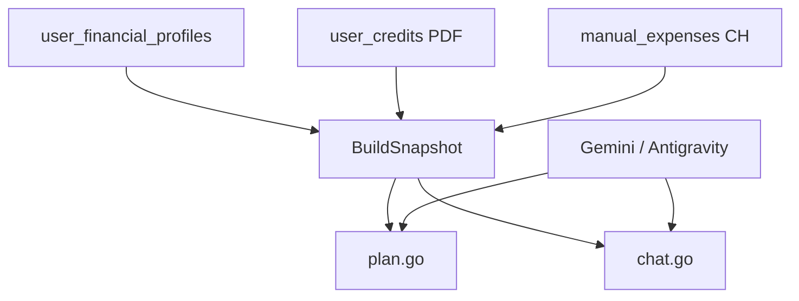

# Питч для backend-разработчика (5–10 мин)

## 1. Карта сервисов (1 мин)

Единый вход: **api-gateway :8000** → reverse proxy по префиксам.

| Сервис | Порт | MVP-роль |
|--------|------|----------|
| user-service | 8001 | auth, `/users/me/profile` |
| receipt-service | 8002 | dashboard API, receipts |
| scraper-service | 8003 | legacy ingest (mock, email) |
| credit-service | 8009 | PDF scan, DTI, rates client |
| ai-processor | 8100 | expenses, advisor, onboarding parse |
| analytics-service | 8101 | insights, scenarios, forecast |
| bank-service | 8011 | ипотечный разбор (optional demo) |

Infra: PostgreSQL 18, ClickHouse 25.12, Kafka 4.0, Redis 8.8.

Полная таблица: [architecture/overview.md](../architecture/overview.md).  
Pitch Q&A: [architecture/defense.md](../architecture/defense.md).

---

## 2. Запуск и smoke (1 мин)

```bash
cd backend   # worktree `back`
cp .env.example .env
make infra && make migrate && make up
make test    # unit tests
./scripts/smoke_critical.sh
./scripts/smoke_auth_chat.sh   # plan + chat + source badge
```

Demo API path: [deployment/scripts/demo_flow.sh](../deployment/scripts/demo_flow.sh).

---

## 3. Advisor pipeline (2–3 мин)



| Файл | Роль |
|------|------|
| `internal/advisor/snapshot.go` | `UserFinanceSnapshot`, skip-flags, data_completeness |
| `internal/advisor/plan.go` | plan + diagnosis |
| `internal/advisor/chat.go` | chat + SSE stream |
| `internal/llm/prompts_advisor.go` | system prompts |
| `internal/llm/client.go` | Gemini direct + Antigravity OpenAI route |
| `services/.../ai-processor/internal/advisor/handler.go` | HTTP |

**Эндпоинты:**

- `GET /api/v1/ai/plan`
- `GET /api/v1/ai/diagnosis`
- `POST /api/v1/ai/chat`
- `POST /api/v1/ai/chat/stream` (SSE)
- `GET/DELETE /api/v1/ai/chat/history`

**Skip-aware:** `skipped_income: true` → не трактовать `active_income=0` как факт.

Детали: [architecture/advisor-system.md](../architecture/advisor-system.md).

---

## 4. LLM dual-mode (1 мин)

| Режим | Env |
|-------|-----|
| Google Gemini direct | `GEMINI_API_KEY`, default model |
| Antigravity proxy | `GEMINI_BASE_URL=http://host.docker.internal:8045/v1`, `GEMINI_MODEL=claude-sonnet-4-6` |

Fallback: heuristic/regex если LLM недоступен → `source: heuristic` в JSON.

Setup: [deployment/antigravity-setup.md](../deployment/antigravity-setup.md), [llm-integration.md](../architecture/llm-integration.md).

---

## 5. Credits PDF scan (1–2 мин)

```
POST /credits/scan (multipart PDF)
  → credit-service
  → text extract (pdf parser)
  → OnlySQ / regex extract fields
  → rates-aggregator benchmark
  → INSERT user_credits
GET /credits/dashboard → DTI %, credits[]
```

- Кириллические PDF — поддержка через text extraction + LLM.
- **Нет** demo hardcode в handler — пустой dashboard до первого scan.
- bank-service **не** источник кредитов в MVP.

Док: [features/credit-scan.md](../features/credit-scan.md).

---

## 6. Expenses ingest (1 мин)

| Path | Handler |
|------|---------|
| `POST /receipt/manual` | ai-processor → categorize → PG + CH |
| `POST /receipt/voice` | parse speech → same pipeline |
| `POST /onboarding/parse` | OnlySQ + local fallback |

Kafka: `receipt.raw` → enriched → ClickHouse для dashboard aggregates.

---

## 7. Kafka / PG / CH — «зачем» (30 сек)

| Store | Зачем на demo |
|-------|---------------|
| PostgreSQL | users, profile, credits, manual_expenses |
| ClickHouse | OLAP dashboard (categories, timemachine) |
| Kafka | decouple ingest от enrichment (receipt pipeline) |

На защите: «разделили write path и analytics path — dashboard не давит OLTP».

---

## 8. Removed from MVP

- `goal-service` — цель в `user_financial_profiles`
- `/goals/*`, `/challenges/*`
- social-service
- FNS backend endpoints — не в critical demo path (front mock)

Scope: [product/scope.md](../product/scope.md).

---

## 9. API contract

Единый источник: [api/API_Contract.md](../api/API_Contract.md).  
OpenAPI: [contracts/openapi.yaml](../contracts/openapi.yaml).

Gateway routing table — первый раздел контракта.

---

## Q&A

**«Где snapshot берёт цель?»** — из profile, не из goal-service.

**«PG или file-store?»** — MVP demo OK на file-store; миграции PG готовы, Phase 1.5 — PG-backed sources.

**«Почему Go, не Python для AI?»** — один runtime, низкая latency, ai-processor уже Go + HTTP LLM client.
